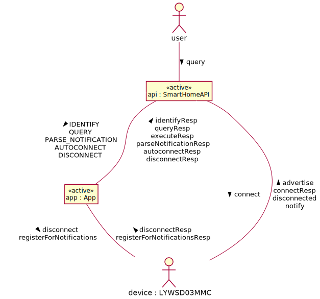
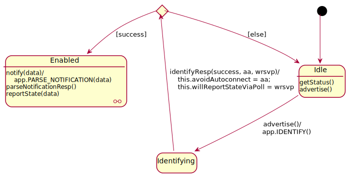
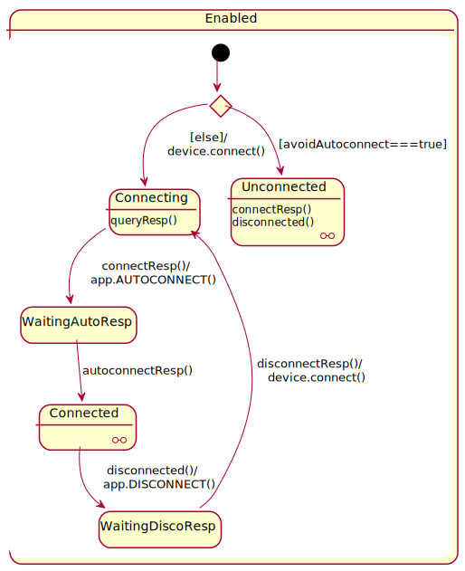
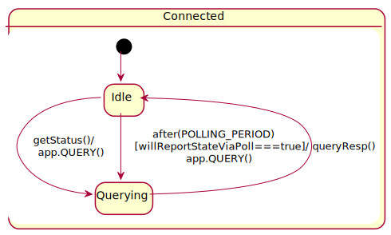
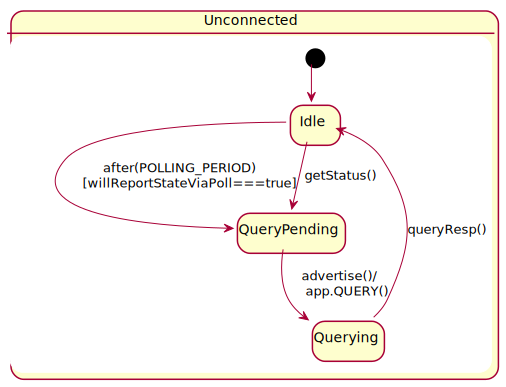
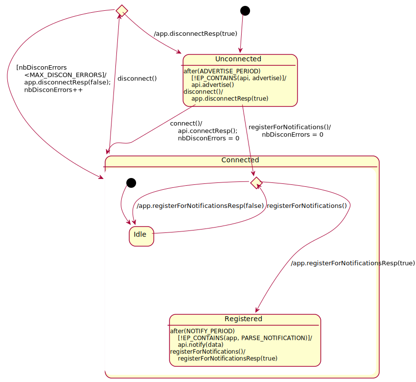
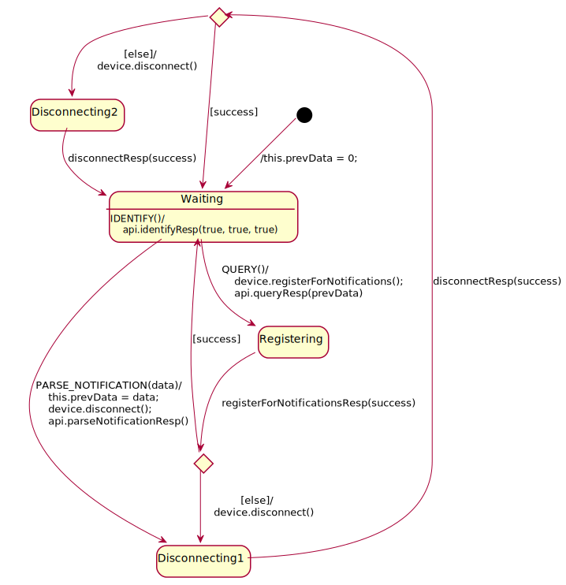
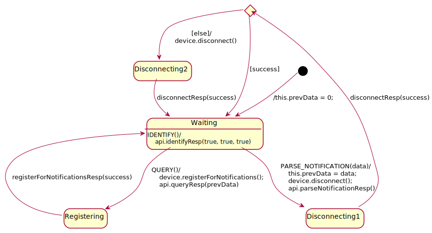

This repository contains additional material for our smart home case study, which is about modeling a [Google Smart Home local fulfillment](https://developers.google.com/assistant/smarthome/concepts/local) app for the LYWSD03MMC device with [AnimUML](https://github.com/ESEO-Tech/AnimUML).
Some information about this device can be found, for instance, as part of [its description in ESPHome's documentation](https://esphome.io/components/sensor/xiaomi_ble.html\#lywsd03mmc).

This repository is currently work in progress.

All diagrams are automatically generated from the AnimUML model.
There are actually two versions of this model (click on the links below to open them in AnimUML):
* an [incorrect one](https://animuml20220518.kher.nl/AnimUML.html#{%22name%22:%22Imported_LocalFulfillment%22,%22objects%22:[{%22name%22:%22user%22,%22isActor%22:true,%22stateByName%22:{%22init%22:{%22type%22:%22Pseudostate%22,%22kind%22:%22initial%22},%22Waiting%22:{%22internalTransitions%22:{%22T1%22:{%22guard%22:%22!EP_CONTAINS(api,%20getStatus)%22,%22effect%22:%22api.getStatus();%22}}}},%22transitionByName%22:{%22init2Waiting_1%22:{%22source%22:%22init%22,%22target%22:%22Waiting%22}}},{%22name%22:%22api%22,%22class%22:%22SmartHomeAPI%22,%22stateByName%22:{%22choice%22:{%22kind%22:%22choice%22},%22init%22:{%22type%22:%22Pseudostate%22,%22kind%22:%22initial%22},%22Idle%22:{%22internalTransitions%22:{%22T1%22:{%22trigger%22:%22getStatus()%22},%22T2%22:{%22trigger%22:%22advertise()%22}}},%22Enabled%22:{%22stateByName%22:{%22choice%22:{%22kind%22:%22choice%22},%22init%22:{%22type%22:%22Pseudostate%22,%22kind%22:%22initial%22},%22Unconnected%22:{%22stateByName%22:{%22init%22:{%22type%22:%22Pseudostate%22,%22kind%22:%22initial%22}},%22transitionByName%22:{%22init2Idle_1%22:{%22source%22:%22init%22,%22target%22:%22Idle%22},%22Idle2QueryPending_1%22:{%22source%22:%22Idle%22,%22target%22:%22QueryPending%22,%22trigger%22:%22after(POLLING_PERIOD)%22,%22guard%22:%22willReportStateViaPoll===true%22},%22Idle2QueryPending_2%22:{%22source%22:%22Idle%22,%22target%22:%22QueryPending%22,%22trigger%22:%22getStatus()%22},%22QueryPending2Querying_1%22:{%22source%22:%22QueryPending%22,%22target%22:%22Querying%22,%22trigger%22:%22advertise()%22,%22effect%22:%22app.QUERY()%22},%22Querying2Idle_1%22:{%22source%22:%22Querying%22,%22target%22:%22Idle%22,%22trigger%22:%22queryResp()%22}},%22internalTransitions%22:{%22T1%22:{%22trigger%22:%22connectResp()%22},%22T2%22:{%22trigger%22:%22disconnected()%22}}},%22Connecting%22:{%22internalTransitions%22:{%22T1%22:{%22trigger%22:%22queryResp()%22}}},%22Connected%22:{%22stateByName%22:{%22init%22:{%22type%22:%22Pseudostate%22,%22kind%22:%22initial%22}},%22transitionByName%22:{%22init2Idle_1%22:{%22source%22:%22init%22,%22target%22:%22Idle%22},%22Idle2Querying_1%22:{%22source%22:%22Idle%22,%22target%22:%22Querying%22,%22trigger%22:%22getStatus()%22,%22effect%22:%22app.QUERY()%22},%22Idle2Querying_2%22:{%22source%22:%22Idle%22,%22target%22:%22Querying%22,%22trigger%22:%22after(POLLING_PERIOD)%22,%22guard%22:%22willReportStateViaPoll===true%22,%22effect%22:%22app.QUERY()%22},%22Querying2Idle_1%22:{%22source%22:%22Querying%22,%22target%22:%22Idle%22,%22trigger%22:%22queryResp()%22}}}},%22transitionByName%22:{%22init2choice_1%22:{%22source%22:%22init%22,%22target%22:%22choice%22},%22choice2Unconnected_1%22:{%22source%22:%22choice%22,%22target%22:%22Unconnected%22,%22guard%22:%22avoidAutoconnect===true%22},%22choice2Connecting_1%22:{%22source%22:%22choice%22,%22target%22:%22Connecting%22,%22guard%22:%22else%22,%22effect%22:%22device.connect()%22},%22Connecting2WaitingAutoResp_1%22:{%22source%22:%22Connecting%22,%22target%22:%22WaitingAutoResp%22,%22trigger%22:%22connectResp()%22,%22effect%22:%22app.AUTOCONNECT()%22},%22WaitingAutoResp2Connected_1%22:{%22source%22:%22WaitingAutoResp%22,%22target%22:%22Connected%22,%22trigger%22:%22autoconnectResp()%22},%22Connected2WaitingDiscoResp_1%22:{%22source%22:%22Connected%22,%22target%22:%22WaitingDiscoResp%22,%22trigger%22:%22disconnected()%22,%22effect%22:%22app.DISCONNECT()%22},%22WaitingDiscoResp2Connecting_1%22:{%22source%22:%22WaitingDiscoResp%22,%22target%22:%22Connecting%22,%22trigger%22:%22disconnectResp()%22,%22effect%22:%22device.connect()%22}},%22internalTransitions%22:{%22T1%22:{%22trigger%22:%22notify(data)%22,%22effect%22:%22app.PARSE_NOTIFICATION(data)%22},%22T2%22:{%22trigger%22:%22parseNotificationResp()%22},%22T3%22:{%22trigger%22:%22reportState(data)%22}}}},%22transitionByName%22:{%22init2Idle_1%22:{%22source%22:%22init%22,%22target%22:%22Idle%22},%22Idle2Identifying_1%22:{%22source%22:%22Idle%22,%22target%22:%22Identifying%22,%22trigger%22:%22advertise()%22,%22effect%22:%22app.IDENTIFY()%22},%22Identifying2choice_1%22:{%22source%22:%22Identifying%22,%22target%22:%22choice%22,%22trigger%22:%22identifyResp(success,%20aa,%20wrsvp)%22,%22effect%22:%22this.avoidAutoconnect%20=%20aa;%5Cnthis.willReportStateViaPoll%20=%20wrsvp%22},%22choice2Enabled_1%22:{%22source%22:%22choice%22,%22target%22:%22Enabled%22,%22guard%22:%22success%22},%22choice2Idle_1%22:{%22source%22:%22choice%22,%22target%22:%22Idle%22,%22guard%22:%22else%22}},%22operationByName%22:{%22identifyResp%22:{%22parameters%22:[{%22name%22:%22success%22,%22type%22:%22Boolean%22},{%22name%22:%22avoidAutoconnect%22,%22type%22:%22Boolean%22},{%22name%22:%22willReportStateViaPoll%22,%22type%22:%22Boolean%22}],%22private%22:false},%22queryResp%22:{%22private%22:false},%22executeResp%22:{%22private%22:false},%22parseNotificationResp%22:{%22private%22:false}}},{%22name%22:%22app%22,%22class%22:%22App%22,%22stateByName%22:{%22disconnectionChoice%22:{%22kind%22:%22choice%22},%22init%22:{%22type%22:%22Pseudostate%22,%22kind%22:%22initial%22},%22Waiting%22:{%22internalTransitions%22:{%22T1%22:{%22trigger%22:%22IDENTIFY()%22,%22effect%22:%22api.identifyResp(true,%20true,%20true)%22}}}},%22transitionByName%22:{%22init2Waiting_1%22:{%22source%22:%22init%22,%22target%22:%22Waiting%22,%22effect%22:%22this.prevData%20=%200;%22},%22Waiting2Registering_1%22:{%22source%22:%22Waiting%22,%22target%22:%22Registering%22,%22trigger%22:%22QUERY()%22,%22effect%22:%22device.registerForNotifications();%5Cnapi.queryResp(prevData)%22},%22Registering2Waiting_1%22:{%22source%22:%22Registering%22,%22target%22:%22Waiting%22,%22trigger%22:%22registerForNotificationsResp(success)%22},%22Waiting2Disconnecting1_1%22:{%22source%22:%22Waiting%22,%22target%22:%22Disconnecting1%22,%22trigger%22:%22PARSE_NOTIFICATION(data)%22,%22effect%22:%22this.prevData%20=%20data;%5Cndevice.disconnect();%5Cnapi.parseNotificationResp()%22},%22Disconnecting12disconnectionChoice_1%22:{%22source%22:%22Disconnecting1%22,%22target%22:%22disconnectionChoice%22,%22trigger%22:%22disconnectResp(success)%22},%22disconnectionChoice2Waiting_1%22:{%22source%22:%22disconnectionChoice%22,%22target%22:%22Waiting%22,%22guard%22:%22success%22},%22disconnectionChoice2Disconnecting2_1%22:{%22source%22:%22disconnectionChoice%22,%22target%22:%22Disconnecting2%22,%22guard%22:%22else%22,%22effect%22:%22device.disconnect()%22},%22Disconnecting22Waiting_1%22:{%22source%22:%22Disconnecting2%22,%22target%22:%22Waiting%22,%22trigger%22:%22disconnectResp(success)%22}},%22operationByName%22:{%22IDENTIFY%22:{%22parameters%22:[{%22name%22:%22request%22}],%22private%22:false},%22QUERY%22:{%22parameters%22:[{%22name%22:%22request%22}],%22private%22:false},%22PARSE_NOTIFICATION%22:{%22parameters%22:[{%22name%22:%22request%22}],%22private%22:false},%22disconnectResp%22:{%22parameters%22:[{%22name%22:%22success%22,%22type%22:%22Boolean%22}],%22private%22:false},%22registerForNotificationsResp%22:{%22parameters%22:[{%22name%22:%22success%22,%22type%22:%22Boolean%22}],%22private%22:false}}},{%22name%22:%22device%22,%22class%22:%22LYWSD03MMC%22,%22isActor%22:true,%22stateByName%22:{%22disconnecting%22:{%22kind%22:%22choice%22},%22init%22:{%22type%22:%22Pseudostate%22,%22kind%22:%22initial%22},%22Unconnected%22:{%22internalTransitions%22:{%22T1%22:{%22trigger%22:%22after(ADVERTISE_PERIOD)%22,%22guard%22:%22!EP_CONTAINS(api,%20advertise)%22,%22effect%22:%22api.advertise()%22},%22T2%22:{%22trigger%22:%22disconnect()%22,%22effect%22:%22app.disconnectResp(true)%22}}},%22Connected%22:{%22stateByName%22:{%22Registering%22:{%22kind%22:%22choice%22},%22init%22:{%22type%22:%22Pseudostate%22,%22kind%22:%22initial%22},%22Registered%22:{%22internalTransitions%22:{%22T1%22:{%22trigger%22:%22after(NOTIFY_PERIOD)%22,%22guard%22:%22!EP_CONTAINS(app,%20PARSE_NOTIFICATION)%22,%22effect%22:%22api.notify(data)%22},%22T2%22:{%22trigger%22:%22registerForNotifications()%22,%22effect%22:%22registerForNotificationsResp(true)%22}}}},%22transitionByName%22:{%22init2Idle_1%22:{%22source%22:%22init%22,%22target%22:%22Idle%22},%22Idle2Registering_1%22:{%22source%22:%22Idle%22,%22target%22:%22Registering%22,%22trigger%22:%22registerForNotifications()%22},%22Registering2Idle_1%22:{%22source%22:%22Registering%22,%22target%22:%22Idle%22,%22effect%22:%22app.registerForNotificationsResp(false)%22},%22Registering2Registered_1%22:{%22source%22:%22Registering%22,%22target%22:%22Registered%22,%22effect%22:%22app.registerForNotificationsResp(true)%22}}}},%22transitionByName%22:{%22init2Unconnected_1%22:{%22source%22:%22init%22,%22target%22:%22Unconnected%22},%22Unconnected2Connected_1%22:{%22source%22:%22Unconnected%22,%22target%22:%22Connected%22,%22trigger%22:%22connect()%22,%22effect%22:%22api.connectResp();%5CnnbDisconErrors%20=%200%22},%22Connected2disconnecting_1%22:{%22source%22:%22Connected%22,%22target%22:%22disconnecting%22,%22trigger%22:%22disconnect()%22},%22disconnecting2Connected_1%22:{%22source%22:%22disconnecting%22,%22target%22:%22Connected%22,%22guard%22:%22nbDisconErrors%5Cn%3CMAX_DISCON_ERRORS%22,%22effect%22:%22app.disconnectResp(false);%5CnnbDisconErrors++%22},%22disconnecting2Unconnected_1%22:{%22source%22:%22disconnecting%22,%22target%22:%22Unconnected%22,%22effect%22:%22app.disconnectResp(true)%22},%22Unconnected2Connected.Registering_1%22:{%22source%22:%22Unconnected%22,%22target%22:%22Connected.Registering%22,%22trigger%22:%22registerForNotifications()%22,%22effect%22:%22nbDisconErrors%20=%200%22}},%22operationByName%22:{%22disconnect%22:{%22private%22:false},%22registerForNotifications%22:{%22private%22:false}},%22propertyByName%22:{%22MAX_DISCON_ERRORS%22:{%22private%22:true,%22type%22:%22Integer%22,%22defaultValue%22:%221%22}}}],%22connectorByName%22:{%22user2api%22:{%22ends%22:[%22user%22,%22api%22],%22possibleMessages%22:{%22forward%22:[%22getStatus%22]}},%22api2app%22:{%22ends%22:[%22api%22,%22app%22],%22possibleMessages%22:{%22forward%22:[%22IDENTIFY%22,%22QUERY%22,%22PARSE_NOTIFICATION%22,%22AUTOCONNECT%22,%22DISCONNECT%22],%22reverse%22:[%22identifyResp%22,%22queryResp%22,%22executeResp%22,%22parseNotificationResp%22,%22autoconnectResp%22,%22disconnectResp%22]}},%22app2device%22:{%22ends%22:[%22app%22,%22device%22],%22possibleMessages%22:{%22forward%22:[%22disconnect%22,%22registerForNotifications%22],%22reverse%22:[%22disconnectResp%22,%22registerForNotificationsResp%22]}},%22api2device%22:{%22ends%22:[%22api%22,%22device%22],%22possibleMessages%22:{%22forward%22:[%22connect%22],%22reverse%22:[%22advertise%22,%22connectResp%22,%22disconnected%22,%22notify%22]}}},%22watchExpressions%22:{%22disconnectRequested%22:%22EP_CONTAINS(device,%20disconnect)%22,%22disconnected%22:%22IS_IN_STATE(device,%20device.Unconnected)%22,%22apiIdle%22:%22IS_IN_STATE(api,%20api.Idle)%22,%22queryRequested%22:%22EP_CONTAINS(app,%20QUERY)%22,%22stateReported%22:%22EP_CONTAINS(api,%20reportState)%22,%22identifyRequested%22:%22EP_CONTAINS(app,%20IDENTIFY)%22},%22LTLProperties%22:{%22appCanStart%22:%22[]%20(identifyRequested%20-%3E%20%3C%3E%20queryRequested)%22,%22keepsQuerying%22:%22[]%20%3C%3E%20(queryRequested%20||%20stateReported%20||%20apiIdle)%22,%22disconnection%22:%22[]%20(disconnectRequested%20-%3E%20%3C%3E%20disconnected)%22},%22settings%22:{%22display%22:{%22hideLinks%22:false,%22hideClasses%22:false,%22hideOperations%22:false,%22hideMethods%22:false,%22showPorts%22:false,%22showEndNames%22:false,%22hideStateMachines%22:false,%22hideOuterSMBoxes%22:false,%22showExplicitSM%22:false,%22hideStates%22:false,%22showPseudostateInvariants%22:false,%22hideSets%22:false,%22showTransitions%22:false},%22semantics%22:{%22fireInitialTransitions%22:true,%22autoFireAfterChoice%22:false,%22autoReceiveDisabled%22:false,%22considerGuardsTrue%22:false,%22checkEvents%22:true,%22keepOneMessagePerTrigger%22:true,%22enableEventPools%22:true,%22matchFirst%22:true,%22symbolicValues%22:false,%22reactiveSystem%22:true},%22interface%22:{%22hideEmptyHistory%22:false,%22disableInteractionSelection%22:false,%22disableModelSelection%22:false,%22disableObjectSelection%22:false,%22disableDoc%22:false,%22disableSettings%22:false,%22disableHistorySettings%22:false,%22disableReset%22:false,%22disableSwitchDiagram%22:false,%22onlyInteraction%22:false,%22hideInteraction%22:false,%22disableExports%22:false,%22hideHistory%22:true,%22disableEdit%22:false,%22historyType%22:%22TCSVG%20sequence%22},%22tools%22:{}}}) containing an erroneous version of the `app` State Machine (see [diagram below](#erroneous-version))
* a [fixed one](https://animuml20220518.kher.nl/AnimUML.html#{%22name%22:%22Imported_LocalFulfillment%22,%22objects%22:[{%22name%22:%22user%22,%22isActor%22:true,%22stateByName%22:{%22init%22:{%22type%22:%22Pseudostate%22,%22kind%22:%22initial%22},%22Waiting%22:{%22internalTransitions%22:{%22T1%22:{%22guard%22:%22!EP_CONTAINS(api,%20getStatus)%22,%22effect%22:%22api.getStatus();%22}}}},%22transitionByName%22:{%22init2Waiting_1%22:{%22source%22:%22init%22,%22target%22:%22Waiting%22}}},{%22name%22:%22api%22,%22class%22:%22SmartHomeAPI%22,%22stateByName%22:{%22choice%22:{%22kind%22:%22choice%22},%22init%22:{%22type%22:%22Pseudostate%22,%22kind%22:%22initial%22},%22Idle%22:{%22internalTransitions%22:{%22T1%22:{%22trigger%22:%22getStatus()%22},%22T2%22:{%22trigger%22:%22advertise()%22}}},%22Enabled%22:{%22stateByName%22:{%22choice%22:{%22kind%22:%22choice%22},%22init%22:{%22type%22:%22Pseudostate%22,%22kind%22:%22initial%22},%22Unconnected%22:{%22stateByName%22:{%22init%22:{%22type%22:%22Pseudostate%22,%22kind%22:%22initial%22}},%22transitionByName%22:{%22init2Idle_1%22:{%22source%22:%22init%22,%22target%22:%22Idle%22},%22Idle2QueryPending_1%22:{%22source%22:%22Idle%22,%22target%22:%22QueryPending%22,%22trigger%22:%22after(POLLING_PERIOD)%22,%22guard%22:%22willReportStateViaPoll===true%22},%22Idle2QueryPending_2%22:{%22source%22:%22Idle%22,%22target%22:%22QueryPending%22,%22trigger%22:%22getStatus()%22},%22QueryPending2Querying_1%22:{%22source%22:%22QueryPending%22,%22target%22:%22Querying%22,%22trigger%22:%22advertise()%22,%22effect%22:%22app.QUERY()%22},%22Querying2Idle_1%22:{%22source%22:%22Querying%22,%22target%22:%22Idle%22,%22trigger%22:%22queryResp()%22}},%22internalTransitions%22:{%22T1%22:{%22trigger%22:%22connectResp()%22},%22T2%22:{%22trigger%22:%22disconnected()%22}}},%22Connecting%22:{%22internalTransitions%22:{%22T1%22:{%22trigger%22:%22queryResp()%22}}},%22Connected%22:{%22stateByName%22:{%22init%22:{%22type%22:%22Pseudostate%22,%22kind%22:%22initial%22}},%22transitionByName%22:{%22init2Idle_1%22:{%22source%22:%22init%22,%22target%22:%22Idle%22},%22Idle2Querying_1%22:{%22source%22:%22Idle%22,%22target%22:%22Querying%22,%22trigger%22:%22getStatus()%22,%22effect%22:%22app.QUERY()%22},%22Idle2Querying_2%22:{%22source%22:%22Idle%22,%22target%22:%22Querying%22,%22trigger%22:%22after(POLLING_PERIOD)%22,%22guard%22:%22willReportStateViaPoll===true%22,%22effect%22:%22app.QUERY()%22},%22Querying2Idle_1%22:{%22source%22:%22Querying%22,%22target%22:%22Idle%22,%22trigger%22:%22queryResp()%22}}}},%22transitionByName%22:{%22init2choice_1%22:{%22source%22:%22init%22,%22target%22:%22choice%22},%22choice2Unconnected_1%22:{%22source%22:%22choice%22,%22target%22:%22Unconnected%22,%22guard%22:%22avoidAutoconnect===true%22},%22choice2Connecting_1%22:{%22source%22:%22choice%22,%22target%22:%22Connecting%22,%22guard%22:%22else%22,%22effect%22:%22device.connect()%22},%22Connecting2WaitingAutoResp_1%22:{%22source%22:%22Connecting%22,%22target%22:%22WaitingAutoResp%22,%22trigger%22:%22connectResp()%22,%22effect%22:%22app.AUTOCONNECT()%22},%22WaitingAutoResp2Connected_1%22:{%22source%22:%22WaitingAutoResp%22,%22target%22:%22Connected%22,%22trigger%22:%22autoconnectResp()%22},%22Connected2WaitingDiscoResp_1%22:{%22source%22:%22Connected%22,%22target%22:%22WaitingDiscoResp%22,%22trigger%22:%22disconnected()%22,%22effect%22:%22app.DISCONNECT()%22},%22WaitingDiscoResp2Connecting_1%22:{%22source%22:%22WaitingDiscoResp%22,%22target%22:%22Connecting%22,%22trigger%22:%22disconnectResp()%22,%22effect%22:%22device.connect()%22}},%22internalTransitions%22:{%22T1%22:{%22trigger%22:%22notify(data)%22,%22effect%22:%22app.PARSE_NOTIFICATION(data)%22},%22T2%22:{%22trigger%22:%22parseNotificationResp()%22},%22T3%22:{%22trigger%22:%22reportState(data)%22}}}},%22transitionByName%22:{%22init2Idle_1%22:{%22source%22:%22init%22,%22target%22:%22Idle%22},%22Idle2Identifying_1%22:{%22source%22:%22Idle%22,%22target%22:%22Identifying%22,%22trigger%22:%22advertise()%22,%22effect%22:%22app.IDENTIFY()%22},%22Identifying2choice_1%22:{%22source%22:%22Identifying%22,%22target%22:%22choice%22,%22trigger%22:%22identifyResp(success,%20aa,%20wrsvp)%22,%22effect%22:%22this.avoidAutoconnect%20=%20aa;%5Cnthis.willReportStateViaPoll%20=%20wrsvp%22},%22choice2Enabled_1%22:{%22source%22:%22choice%22,%22target%22:%22Enabled%22,%22guard%22:%22success%22},%22choice2Idle_1%22:{%22source%22:%22choice%22,%22target%22:%22Idle%22,%22guard%22:%22else%22}},%22operationByName%22:{%22identifyResp%22:{%22parameters%22:[{%22name%22:%22success%22,%22type%22:%22Boolean%22},{%22name%22:%22avoidAutoconnect%22,%22type%22:%22Boolean%22},{%22name%22:%22willReportStateViaPoll%22,%22type%22:%22Boolean%22}],%22private%22:false},%22queryResp%22:{%22private%22:false},%22executeResp%22:{%22private%22:false},%22parseNotificationResp%22:{%22private%22:false}}},{%22name%22:%22app%22,%22class%22:%22App%22,%22stateByName%22:{%22disconnectionChoice%22:{%22kind%22:%22choice%22},%22init%22:{%22type%22:%22Pseudostate%22,%22kind%22:%22initial%22},%22Waiting%22:{%22internalTransitions%22:{%22T1%22:{%22trigger%22:%22IDENTIFY()%22,%22effect%22:%22api.identifyResp(true,%20true,%20true)%22}}},%22registeringChoice%22:{%22kind%22:%22choice%22}},%22transitionByName%22:{%22init2Waiting_1%22:{%22source%22:%22init%22,%22target%22:%22Waiting%22,%22effect%22:%22this.prevData%20=%200;%22},%22Waiting2Registering_1%22:{%22source%22:%22Waiting%22,%22target%22:%22Registering%22,%22trigger%22:%22QUERY()%22,%22effect%22:%22device.registerForNotifications();%5Cnapi.queryResp(prevData)%22},%22Registering2registeringChoice_1%22:{%22source%22:%22Registering%22,%22target%22:%22registeringChoice%22,%22trigger%22:%22registerForNotificationsResp(success)%22},%22registeringChoice2Waiting_1%22:{%22source%22:%22registeringChoice%22,%22target%22:%22Waiting%22,%22guard%22:%22success%22},%22registeringChoice2Disconnecting1_1%22:{%22source%22:%22registeringChoice%22,%22target%22:%22Disconnecting1%22,%22guard%22:%22else%22,%22effect%22:%22device.disconnect()%22},%22Waiting2Disconnecting1_1%22:{%22source%22:%22Waiting%22,%22target%22:%22Disconnecting1%22,%22trigger%22:%22PARSE_NOTIFICATION(data)%22,%22effect%22:%22this.prevData%20=%20data;%5Cndevice.disconnect();%5Cnapi.parseNotificationResp()%22},%22Disconnecting12disconnectionChoice_1%22:{%22source%22:%22Disconnecting1%22,%22target%22:%22disconnectionChoice%22,%22trigger%22:%22disconnectResp(success)%22},%22disconnectionChoice2Waiting_1%22:{%22source%22:%22disconnectionChoice%22,%22target%22:%22Waiting%22,%22guard%22:%22success%22},%22disconnectionChoice2Disconnecting2_1%22:{%22source%22:%22disconnectionChoice%22,%22target%22:%22Disconnecting2%22,%22guard%22:%22else%22,%22effect%22:%22device.disconnect()%22},%22Disconnecting22Waiting_1%22:{%22source%22:%22Disconnecting2%22,%22target%22:%22Waiting%22,%22trigger%22:%22disconnectResp(success)%22}},%22operationByName%22:{%22IDENTIFY%22:{%22parameters%22:[{%22name%22:%22request%22}],%22private%22:false},%22QUERY%22:{%22parameters%22:[{%22name%22:%22request%22}],%22private%22:false},%22PARSE_NOTIFICATION%22:{%22parameters%22:[{%22name%22:%22request%22}],%22private%22:false},%22disconnectResp%22:{%22parameters%22:[{%22name%22:%22success%22,%22type%22:%22Boolean%22}],%22private%22:false},%22registerForNotificationsResp%22:{%22parameters%22:[{%22name%22:%22success%22,%22type%22:%22Boolean%22}],%22private%22:false}}},{%22name%22:%22device%22,%22class%22:%22LYWSD03MMC%22,%22isActor%22:true,%22stateByName%22:{%22disconnecting%22:{%22kind%22:%22choice%22},%22init%22:{%22type%22:%22Pseudostate%22,%22kind%22:%22initial%22},%22Unconnected%22:{%22internalTransitions%22:{%22T1%22:{%22trigger%22:%22after(ADVERTISE_PERIOD)%22,%22guard%22:%22!EP_CONTAINS(api,%20advertise)%22,%22effect%22:%22api.advertise()%22},%22T2%22:{%22trigger%22:%22disconnect()%22,%22effect%22:%22app.disconnectResp(true)%22}}},%22Connected%22:{%22stateByName%22:{%22Registering%22:{%22kind%22:%22choice%22},%22init%22:{%22type%22:%22Pseudostate%22,%22kind%22:%22initial%22},%22Registered%22:{%22internalTransitions%22:{%22T1%22:{%22trigger%22:%22after(NOTIFY_PERIOD)%22,%22guard%22:%22!EP_CONTAINS(app,%20PARSE_NOTIFICATION)%22,%22effect%22:%22api.notify(data)%22},%22T2%22:{%22trigger%22:%22registerForNotifications()%22,%22effect%22:%22registerForNotificationsResp(true)%22}}}},%22transitionByName%22:{%22init2Idle_1%22:{%22source%22:%22init%22,%22target%22:%22Idle%22},%22Idle2Registering_1%22:{%22source%22:%22Idle%22,%22target%22:%22Registering%22,%22trigger%22:%22registerForNotifications()%22},%22Registering2Idle_1%22:{%22source%22:%22Registering%22,%22target%22:%22Idle%22,%22effect%22:%22app.registerForNotificationsResp(false)%22},%22Registering2Registered_1%22:{%22source%22:%22Registering%22,%22target%22:%22Registered%22,%22effect%22:%22app.registerForNotificationsResp(true)%22}}}},%22transitionByName%22:{%22init2Unconnected_1%22:{%22source%22:%22init%22,%22target%22:%22Unconnected%22},%22Unconnected2Connected_1%22:{%22source%22:%22Unconnected%22,%22target%22:%22Connected%22,%22trigger%22:%22connect()%22,%22effect%22:%22api.connectResp();%5CnnbDisconErrors%20=%200%22},%22Connected2disconnecting_1%22:{%22source%22:%22Connected%22,%22target%22:%22disconnecting%22,%22trigger%22:%22disconnect()%22},%22disconnecting2Connected_1%22:{%22source%22:%22disconnecting%22,%22target%22:%22Connected%22,%22guard%22:%22nbDisconErrors%5Cn%3CMAX_DISCON_ERRORS%22,%22effect%22:%22app.disconnectResp(false);%5CnnbDisconErrors++%22},%22disconnecting2Unconnected_1%22:{%22source%22:%22disconnecting%22,%22target%22:%22Unconnected%22,%22effect%22:%22app.disconnectResp(true)%22},%22Unconnected2Connected.Registering_1%22:{%22source%22:%22Unconnected%22,%22target%22:%22Connected.Registering%22,%22trigger%22:%22registerForNotifications()%22,%22effect%22:%22nbDisconErrors%20=%200%22}},%22operationByName%22:{%22disconnect%22:{%22private%22:false},%22registerForNotifications%22:{%22private%22:false}},%22propertyByName%22:{%22MAX_DISCON_ERRORS%22:{%22private%22:true,%22type%22:%22Integer%22,%22defaultValue%22:%221%22}}}],%22connectorByName%22:{%22user2api%22:{%22ends%22:[%22user%22,%22api%22],%22possibleMessages%22:{%22forward%22:[%22getStatus%22]}},%22api2app%22:{%22ends%22:[%22api%22,%22app%22],%22possibleMessages%22:{%22forward%22:[%22IDENTIFY%22,%22QUERY%22,%22PARSE_NOTIFICATION%22,%22AUTOCONNECT%22,%22DISCONNECT%22],%22reverse%22:[%22identifyResp%22,%22queryResp%22,%22executeResp%22,%22parseNotificationResp%22,%22autoconnectResp%22,%22disconnectResp%22]}},%22app2device%22:{%22ends%22:[%22app%22,%22device%22],%22possibleMessages%22:{%22forward%22:[%22disconnect%22,%22registerForNotifications%22],%22reverse%22:[%22disconnectResp%22,%22registerForNotificationsResp%22]}},%22api2device%22:{%22ends%22:[%22api%22,%22device%22],%22possibleMessages%22:{%22forward%22:[%22connect%22],%22reverse%22:[%22advertise%22,%22connectResp%22,%22disconnected%22,%22notify%22]}}},%22watchExpressions%22:{%22disconnectRequested%22:%22EP_CONTAINS(device,%20disconnect)%22,%22disconnected%22:%22IS_IN_STATE(device,%20device.Unconnected)%22,%22apiIdle%22:%22IS_IN_STATE(api,%20api.Idle)%22,%22queryRequested%22:%22EP_CONTAINS(app,%20QUERY)%22,%22stateReported%22:%22EP_CONTAINS(api,%20reportState)%22,%22identifyRequested%22:%22EP_CONTAINS(app,%20IDENTIFY)%22},%22LTLProperties%22:{%22appCanStart%22:%22[]%20(identifyRequested%20-%3E%20%3C%3E%20queryRequested)%22,%22keepsQuerying%22:%22[]%20%3C%3E%20(queryRequested%20||%20stateReported%20||%20apiIdle)%22,%22disconnection%22:%22[]%20(disconnectRequested%20-%3E%20%3C%3E%20disconnected)%22},%22settings%22:{%22display%22:{%22hideLinks%22:false,%22hideClasses%22:false,%22hideOperations%22:false,%22hideMethods%22:false,%22showPorts%22:false,%22showEndNames%22:false,%22hideStateMachines%22:false,%22hideOuterSMBoxes%22:false,%22showExplicitSM%22:false,%22hideStates%22:false,%22showPseudostateInvariants%22:false,%22hideSets%22:false,%22showTransitions%22:false},%22semantics%22:{%22fireInitialTransitions%22:true,%22autoFireAfterChoice%22:false,%22autoReceiveDisabled%22:false,%22considerGuardsTrue%22:false,%22checkEvents%22:true,%22keepOneMessagePerTrigger%22:true,%22enableEventPools%22:true,%22matchFirst%22:true,%22symbolicValues%22:false,%22reactiveSystem%22:true},%22interface%22:{%22hideEmptyHistory%22:false,%22disableInteractionSelection%22:false,%22disableModelSelection%22:false,%22disableObjectSelection%22:false,%22disableDoc%22:false,%22disableSettings%22:false,%22disableHistorySettings%22:false,%22disableReset%22:false,%22disableSwitchDiagram%22:false,%22onlyInteraction%22:false,%22hideInteraction%22:false,%22disableExports%22:false,%22hideHistory%22:true,%22disableEdit%22:false,%22historyType%22:%22TCSVG%20sequence%22},%22tools%22:{}}}) containing the fixed version of the `app` State Machine (see [diagram below](#verified-version))

# Verification Result Example

The following diagram is a sequence diagram representing a failed verification counter example for property *keepsQuerying*: `[] <> (queryRequested || stateReported || apiIdle)`.
It happens when the `app` state machine does not check the response to `registerForNotifications`, and does not attempt to disconnect from the `device` if it failed (see [the erroneous `app` state machine version](#erroneous-version)).
The loop at the end (i.e., the [Büchi](https://en.wikipedia.org/wiki/B%C3%BCchi_automaton) acceptance condition) is empty because the composition of the model with the property is then stuck/deadlocked.
The problem is that the `device` is stuck in its `Idle` state, in which it does not send `advertise` messages, while the `api` is stuck in its `QueryPending` state, waiting for such a message.
The `app` cannot make any progress either in this situation, because it only handles the intents and notifications the `api` sends it.
It is also possible to visualize [the full model state](LocalFulfillment-withError.svg).

# Model Entities and Messages

# `api` State Machine

## Top Level Behavior

## `Enabled` Sub-behavior

## `Connected` Sub-behavior

## `Unconnected` Sub-behavior

# `device` State Machine

# `app` State Machine

## Verified Version

## Erroneous Version

# `user` State Machine

