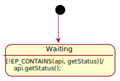

This repository contains additional material for our smart home case study, which is about modeling a [Google Smart Home local fulfillment](https://developers.google.com/assistant/smarthome/concepts/local) app for the LYWSD03MMC device with [AnimUML](https://github.com/fjouault/AnimUML).
Some information about this device can be found, for instance, as part of [its description in ESPHome's documentation](https://esphome.io/components/sensor/xiaomi_ble.html\#lywsd03mmc).

This repository is currently work in progress.

All diagrams are automatically generated from the AnimUML model.

# Verification Result Example

The following diagram is a sequence diagram representing a failed verification counter example.
It happens when the `app` state machine does not check the response to `registerForNotifications`, and does not attempt to disconnect from the `device` if it failed (see [the erroneous `app` state machine version](#erroneous-version)).
The loop at the end (i.e., the [Büchi](https://en.wikipedia.org/wiki/B%C3%BCchi_automaton) acceptance condition) is empty because the model is then stuck/deadlocked.
The problem is that the `device` is stuck in its `Idle` state, in which it does not send `advertise` messages, while the `api` is stuck in its `QueryPending` state, waiting for such a message.
The `app` cannot make any progress either in this situation, because it only handles the intents and notifications the `api` sends it.
It is also possible to visualize [the full model state](LocalFulfillment-withError.svg).

# Model Entities and Messages

# `api` State Machine

## Top Level Behavior

## `Enabled` Sub-behavior

## `Connected` Sub-behavior

## `Unconnected` Sub-behavior

# `device` State Machine

# `app` State Machine

## Verified Version

## Erroneous Version

# `user` State Machine

